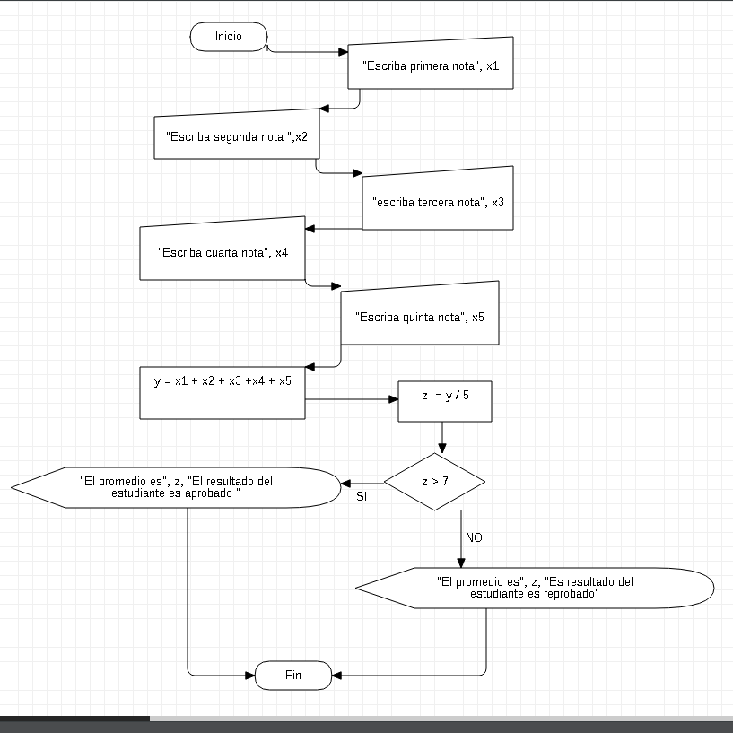

# PROGRAMACION

## FECHA 

## Septiembre 13 2021

En esta clase aprendimos en visual basic que el programa tenga una serie de opciones y para eso utilizamor alli en codigo in(InputBox(texto))

## EJEMPLO EN VISUAL BASIC

```
Sub ejemplo1()
    n = Int(InputBox("Escriba un numero"))
    If (n > 10) Then
        MsgBox "El numero " & n & " es mayor que 10"   
    Else
        
        MsgBox "El numero " & n & " es mayor o igual a 10"    
    End If
End Sub
```

## EJERCICIO EN VISUAL BASIC
```
Sub ejercicio()
    x1 = Int(InputBox("Escribe primera nota"))
    x2 = Int(InputBox("Escribe segunda nota"))
    x3 = Int(InputBox("Escribe tercera nota"))
    x4 = Int(InputBox("Escribe cuarta nota"))
    x5 = Int(InputBox("Escribre quinta nota"))
    y = x1 + x2 + x3 + x4 + x5
    Z = y / 5
    If (Z > 7) Then
        MsgBox "El promedio es " & Z & " El resultado del estudiante es aprobado"
    Else
        MsgBox "El promedio es " & Z & " El resultado del estudiante es reprobado"
    End If
End Sub
```

## DIAGRAMA DE FLUJO EN STAR UML

 